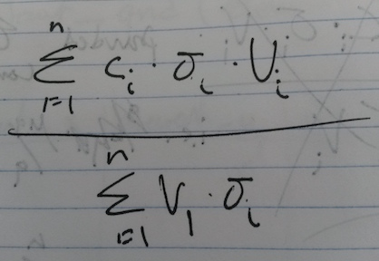
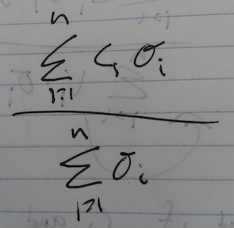
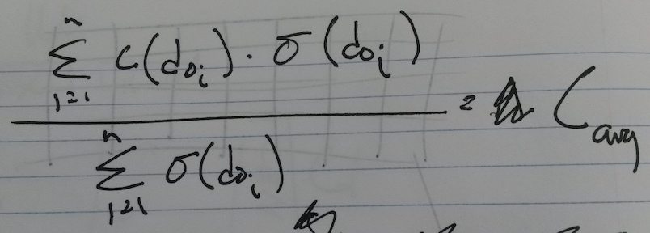

```{r, message=FALSE, warning=FALSE}
library(ggplot2)
library(dplyr)
source("R/deformation_library.R") # functions
source("data-raw/collect_layers.R") # layers data
```

## Introduction

That deformation and compression of lake sediment occurs during coring has long been known (Martin and Miller 1982; Wright 1993), and designs of new coring devices have strived to minimize the conditions that promote deformation during coring (Martin and Miller 1982; Lane and Tafts 2002). Compression of sediment occurs during coring is a widely accepted phenomenon (Glew et al. 2001), however convex upwards deformation, while widely observed (citations including Wright 1993; Rosenbaum et al. 2010; Figure 1), is infrequently discussed. The idea that horizontal sectioning (extrusion) of deformed sediment is undesirable has been previously noted (Rosenbaum et al. 2010), however the degree to which this deformation occurs and the effect that deformation has on paleolimnological data derived from horizontal sectioning has never been investigated quantitatively.

Rather than suggest that deformation does not occur (Glew et al. 2001 Figure 3), or that a particular coring method prevents this from happening (Smol 2009 p35), we suggest that acknowledging deformation and its effect on paleolimnological data is a more reasonable approach. We suspect, given the innumerable paleolimnological studies that use coring and extrusion to produce reasonable and reproducable results, that either deformation or its effect on the data is minimal. This paper is our attempt to quantify and constrain the degree to which convex upwards deformation adds bias to horizontally sectioned paleolimnological data.

If we take a slice through a deformed core (as we would while extruding), what is the distribution of original depths? What is the effect of typical deformation on data obtained from extruded samples? What is the effect of maximum likely deformation in extruded samples? Is there a minimum extrusion interval based on typical deformation in sediment cores?


## Methods

```{r}
# define parameters
barrel_width <- 6 # use 6 cm for barrel width
slice_sizes <- c(0.1, 0.5, 1)
cellsize <- 0.1
```


### Core photo analysis

To calculate parameters for the deformation model, we loaded `r nrow(deformed_core_photos)` scale photos of deformed cores from `r length(unique(deformed_core_photos))` sources into ImageJ software and digitized deformed strata (Table 1). Coordinates were transformed to `ri` and `di` values for individual strata by subtracting the minimum `d` value from the rest of the values, and subtracting the central `x` value from the rest of the values. Power regression (quadratic) was performed on the data to obtain the coefficients for minimum, maximum, and mean levels of deformation. Corer type and core barrel diameter were recorded with these data.

```{r, results='asis'}
knitr::kable(deformed_core_photos, digits=2)
```

### Deformation model

We modeled horizontal sections with height `H` and diameter `D` as a 3-dimensional raster grid with a cell size of 0.25 mm (Figure 2). For each cell `i`, an original depth `d0i` was calculated with the minimum, maximum, and mean parameters obtained from digitized strata. Density histograms were then obtained to estimate the percentage contribution of each original depth `d0` to the slice. For each slice, `d=0` refers to the middle of the slice. We produced these models for `D`=`r barrel_width` cm, as this represents a frequently used barrel diameter for horizontally sectioned cores.


### Effect on paleolimnological data

To model the concentration we would obtain by sectioning and homogenizing a sample with variable concentration (`c`) and density (`density`), we need to calculate total mass of the target substance divided by the mass of the slice. In sigma notation with our deformation model (using `n` cells), this looks like the following:



Because the volume for each cell is constant, we can remove the `Vi` from the summation in both the numerator and denominator. Thus we are left with:



Our initial assumption is that `c` and `density` are a function of (and constatnt for each) `d0i`, our notation collapses to:



Thus we can use our deformation model to simulate the effect of core barrel width, horizontal sectioning interval, and degree of deformation, on idealized high-resolution data. We used fictional paleolimnological data (random log-normal data) to visualize the effect of deformation on stratigraphic data. These data were inspired by ITRAX core scanner data that has a high sample resolution.

```{r}
# generate data
original_data <- create_random_data(seed=2500, smoothing=10, func=rlnorm,
                                    transform=function(x) 1.5 ^ x * 10,
                                    density=c(0.1, 0.5),
                                    maxdepth=20, cellsize=cellsize)

# ggplot(original_data, aes(y=d0, x=vals)) + geom_path() + scale_y_reverse()
```


## Results

### Core photo analysis


```{r}
# plot cores with quadratic smoothing
ggplot(deformed_layer_data, aes(x=r, y=d)) + 
  geom_point(aes(col=factor(layer))) + 
  stat_smooth(method=lm, formula=y ~ poly(x, 2, raw=TRUE), se=FALSE) + 
  scale_y_reverse() + facet_wrap(~photo, scales="free")

# these are used in the model later
mina <- round(min(deformed_layers$a), 3)
maxa <- round(max(deformed_layers$a), 2)
meana <- round(mean(deformed_layers$a), 2)
coeffs <- c(0, mina, meana, maxa)
```

We digitized `r length(unique(deformed_core_photos$layercode))` deformed layers from `r length(unique(deformed_core_photos$core))` scale photos of split cores. The quadratic regression performed produced an excellent fit of the data (r2 from `r format(min(deformed_layers$r2), digits=2)` to `r format(max(deformed_layers$r2), digits=2)`). Coefficients for `x^2` range from `r mina` to `r maxa`, with a mean of `r meana`.


```{r, results='asis'}
knitr::kable(deformed_layers, digits=2)
```

### Deformation model

```{r}
# expand to grid
params <- expand.grid(slicesize=slice_sizes, coeff=coeffs)

# define a wrapper function that will create the model based on the
# parameters we would like to vary
deformation_model_wrapper <- function(slicesize, coeff) {
  deformation_model(slicesize, 
                      d0=function(d, r) d - coeff * r^2, 
                      width = barrel_width, 
                      cellsize = cellsize)
}

# create the models in long form so we can plot with facets
all <- params %>% 
  group_by(slicesize, coeff) %>% 
  do(deformation_model_wrapper(.$slicesize, .$coeff))

# overhead view (same for all sizes of slice)
ggplot(all %>% filter(abs(z)==min(abs(z)), slicesize==all$slicesize[1]), aes(x=x, y=y)) + 
  geom_raster(aes(fill=d0)) + 
  scale_fill_gradient2() + scale_y_reverse() + 
  coord_fixed() + facet_wrap(~coeff)

# side on view
ggplot(all %>% filter(abs(y)==min(abs(y))), aes(x=x, y=z)) + geom_raster(aes(fill=d0)) + 
  scale_fill_gradient2() + scale_y_reverse() + 
  coord_fixed() + facet_grid(slicesize ~ coeff)

# create histograms with binwidth of cellsize, except with the $density param)
create_histogram <- function(vals) {
  limit <- round(max(abs(vals)) / cellsize) * cellsize #snap to cellsize
  breaks <- seq(-limit-cellsize, limit+cellsize, cellsize)
  h <- hist(vals, breaks=breaks, plot=FALSE)
  # fill smoothing model with zeros to make symmetrical
  return(data.frame(d=breaks[-1], density=h$density))
}

histograms <- all %>% 
  group_by(slicesize, coeff) %>% 
  do(create_histogram(.$d0))

# plot (same as density histogram but this is faster)
ggplot(histograms %>% filter(density != 0), aes(x=d, y=density)) + 
  geom_bar(width=cellsize, stat="identity") + 
  facet_grid(slicesize ~ coeff)
```

### Effect on stratigraphic data

Using the formulas, if we model extrusion, this is the effect on the data:

```{r}
sliced <- all %>%
  group_by(slicesize, coeff) %>% 
  do(extrude(., original_data))

ggplot(sliced, aes(y=d, x=vals)) + geom_path() + scale_y_reverse() + 
  facet_grid(slicesize ~ coeff, scales="free_x")
```


## Conclusions

There is a limit to how small extrusion intervals can get based on deformation. For minor deformation, even small extrusion intervals are ok.
