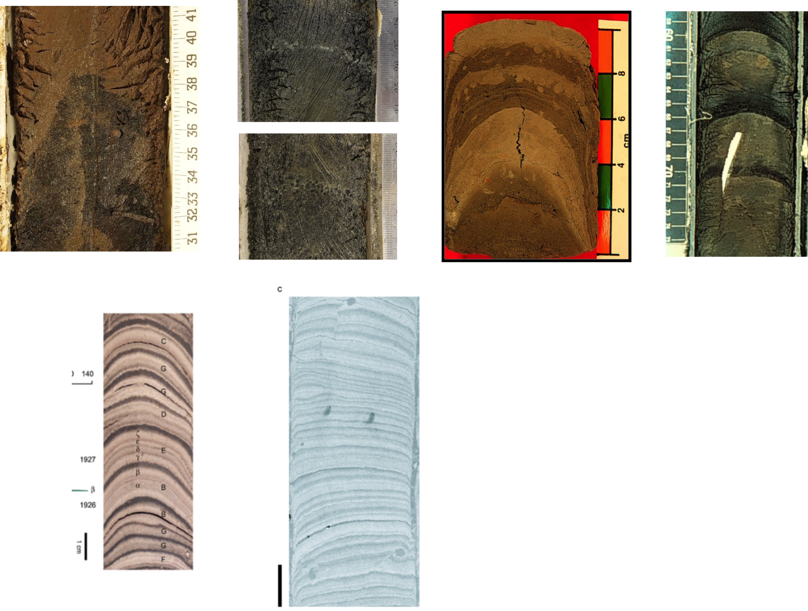
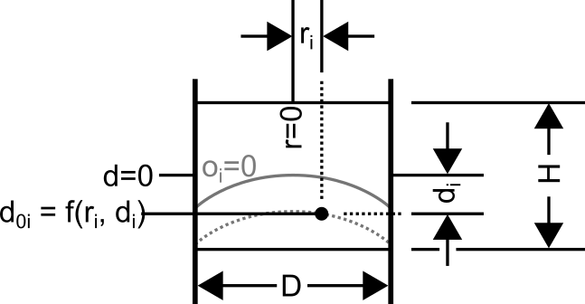

```{r, message=FALSE, warning=FALSE}
library(ggplot2)
library(reshape2)
library(dplyr)
```

## Introduction

That deformation and compression of lake sediment occurs during coring has long been known (Martin and Miller 1982; Wright 1993), and designs of new coring devices have strived to minimize the conditions that promote deformation during coring (Martin and Miller 1982; Lane and Tafts 2002). Compression of sediment occurs during coring is a widely accepted phenomenon (Glew et al. 2001), however convex upwards deformation, while widely observed (citations including Wright 1993; Rosenbaum et al. 2010; Figure 1), is infrequently discussed. The idea that horizontal sectioning (extrusion) of deformed sediment is undesirable has been previously noted (Rosenbaum et al. 2010), however the degree to which this deformation occurs and the effect that deformation has on paleolimnological data derived from horizontal sectioning has never been investigated quantitatively. Rather than suggest that deformation does not occur (Glew et al. 2001 Figure 3), or that a particular coring method prevents this from happening (Smol 2009 p35), we suggest that acknowledging deformation and its effect on paleolimnological data is a more reasonable approach. We suspect, given the innumerable paleolimnological studies that use coring and extrusion to produce reasonable and reproducable results, that either deformation or its effect on the data is minimal. This paper is our attempt to quantify and constrain the degree to which convex upwards deformation adds bias to horizontally sectioned paleolimnological data.

If we take a slice through a deformed core (as we would while extruding), what is the distribution of original depths? What is the effect of typical deformation on data obtained from extruded samples? What is the effect of maximum likely deformation in extruded samples? Is there a minimum extrusion interval based on typical deformation in sediment cores?



## Methods

### Core photo analysis

To calculate parameters for the deformation model, we loaded XXX scale photos of deformed cores into ImageJ software and digitized deformed strata. Coordinates were transformed to `ri` and `di` values for individual strata by subtracting the minimum `d` value from the rest of the values, and subtracting the average `x` value from the rest of the values. Power regression (quadratic) was performed on the data to obtain the coefficients for minimum, maximum, and mean levels of deformation. Corer type and core barrel diameter were recorded with these data.

### Deformation model

We modeled horizontal sections with height `H` and diameter `D` as a 3-dimensional raster grid with a cell size of 0.25 mm (Figure 2). For each cell `i`, an original depth `oi` was calculated with the minimum, maximum, and mean parameters obtained from digitized strata. Density histograms were then obtained to estimate the percentage contribution of each original depth `o` to the slice. For each slice, `d=0` refers to the middle of the slice. We produced these models for `D`=6 cm and `D`=10 cm, as this represents a range that may be used for horizontally sectioned cores.



## Results

### Core photo analysis


```{r}
# load
deformations <- read.csv("deformed cores/deformed_cores_summary.csv")
# calc the x0 and y0 to use as the base coordinates (to transform x and y to r and d)
layers <- deformations %>% 
  group_by(layercode) %>% 
  summarise(x0=mean(range(x)), y0=min(y))
deformations <- merge(deformations, layers, by="layercode")
deformations$r <- deformations$x-deformations$x0
deformations$d <- deformations$y-deformations$y0
deformations <- deformations %>% select(layercode, core, layer, r, d)

# plot cores with quadratic smoothing
ggplot(deformations, aes(x=r, y=d)) + 
  geom_point(aes(col=factor(layer))) + 
  stat_smooth(method=lm, formula=y ~ poly(x, 2, raw=TRUE), se=FALSE) + 
  scale_y_reverse() + facet_wrap(~core, scales="free")

# define the regression function
create_quadratic_model <- function(df) {
  model <- lm(data=df, formula=d ~ poly(r, 2, raw=TRUE))
  return(data.frame(a=model$coefficients[3],
                    r2=summary(model)$r.squared,
                    df=model$df.residual))
}

# calculate quadratic models
modelparams <- deformations %>% 
  group_by(layercode) %>%
  do(create_quadratic_model(.))

```

We digitized `r length(unique(deformations$layercode))` deformed layers from `r length(unique(deformations$core))` scale photos of split cores. The quadratic regression performed produced an excellent fit of the data (r2 from `r format(min(modelparams$r2), digits=2)` to `r format(max(modelparams$r2), digits=2)`). Coefficients for `x^2` range from `r format(min(modelparams$a), digits=2)` to `r format(max(modelparams$a), digits=2)`, with a mean of `r format(mean(modelparams$a), digits=2)`.


```{r, results='asis'}
knitr::kable(modelparams, digits=2)
```

### Deformation model

Imagine we have a 2 cm wide core where we can model deformation as `d = d0 + r^2` (where `r` is the distance to the centre of the core barrel and `d0` is the original depth prior to deformation). It follows that we can then model the original depth of the sediment at a position (d, r) as `d0(d, r) = d - r^2`. Rasterizing this, we can make a model of actual and original depths given a function `d0(d, r)`

```{r}
deformation_model3d <- function(slicesize, d0, width=2, cellsize=0.025) {
  coords <- expand.grid(x=seq(-width/2, width/2, cellsize),
                        y=seq(-width/2, width/2, cellsize),
                        z=seq(-slicesize/2, slicesize/2, cellsize))
  coords$r <- sqrt(coords$x^2 + coords$y^2)
  coords <- coords[coords$r <= width/2,]
  coords$d0 <- d0(coords$z, coords$r)
  return(coords)
}
```

This function takes a `slicesize` (for example, 1 cm) and a function `d0` that returns a the original depth prior to deformation given a depth (`d`) and a radius from the centre of the core (`r`). The `cellsize` parameter specifies the resolution at which to create the model (low values for higher resolution) and the `width` specifies the interior diameter of the core barrel. The `d` values in the model are relative to the centre of the slice. For a single function `d0` and slice size, we can then plot a cross-section and histogram of the depths prior to deformation.

```{r}
model <- deformation_model3d(1, function(d, r) d - r^2)

# overhead view (same for all sizes of slice)
ggplot(model %>% filter(z==0), aes(x=x, y=y)) + 
  geom_raster(aes(fill=d0)) + 
  scale_fill_gradient2() + scale_y_reverse() + 
  coord_fixed()

# side on view
ggplot(model %>% filter(y==0), aes(x=x, y=z)) + geom_raster(aes(fill=d0)) + 
  scale_fill_gradient2() + scale_y_reverse() + 
  coord_fixed()

# density histogram
ggplot(model, aes(x=d0)) + geom_density() 
```

This histogram seems to indicate that the average actual depth (`r mean(model)`) is slightly smaller than the centre of the slice.

## Effect of degree of deformation and slice size

We can also vary these parameters to model the effect of slice size and degree of deformation.

```{r}
# dplyr doesn't like passing functions or evals so we are going to wrap this
# so we can pass a single number
deformation_model_bydegree <- function(slicesize, degree, cellsize=0.025, width=2) {
  d0 <- function(d, r) d - abs(r^degree)
  deformation_model3d(slicesize, d0, width, cellsize)
}

# create the models in long form so we can plot with facets
all <- expand.grid(slicesize=seq(0.2, 1, 0.2), degree=2:6) %>% 
  group_by(slicesize, degree) %>% 
  do(deformation_model_bydegree(.$slicesize, .$degree))

# overhead view (same for all sizes of slice)
ggplot(all %>% filter(z==0, slicesize==all$slicesize[1]), aes(x=x, y=y)) + 
  geom_raster(aes(fill=d0)) + 
  scale_fill_gradient2() + scale_y_reverse() + 
  coord_fixed() + facet_grid(slicesize ~ degree)

# side on view
ggplot(all %>% filter(y==0), aes(x=x, y=z)) + geom_raster(aes(fill=d0)) + 
  scale_fill_gradient2() + scale_y_reverse() + 
  coord_fixed() + facet_grid(slicesize ~ degree)

# density histograms
ggplot(all, aes(x=d0)) + geom_density() + facet_grid(slicesize ~ degree)

# we can also create a table summarizing some things

all_summary <- all %>% summarise(mean_depth=mean(d0))
```

```{r, results='asis', warning=FALSE}
knitr::kable(dcast(all_summary, degree~slicesize), digits=2)
```

Looks like for the even powers this is pretty easy. The weighted average depth of a given slice is always `-1/(degree/2)`. This means the average depth is always slightly less than (25 to 50%) the value stated, regardless of slice thickness.

```{r}
rm(all, all_summary, model, deformation_model_bydegree)
```


## An assessment of actual deformation in cores


## A more realistic model

It appears a quadratic is a good fit for experimental deformation data (where cores are deformed, which not all are). Coefficients for `x^2` range from 0.1 to 0.6. Core barrel diameters range from 2 to 5 inches (5 to 13 cm), so we will use these end members as our test cases.

### Effect of slice size

```{r}
deformation_model_wrapper <- function(slicesize, coeff, width) {
  deformation_model3d(slicesize, d0=function(d, r) d - coeff * r^2, width = width, cellsize = width/100)
}

# create the models in long form so we can plot with facets
all <- expand.grid(slicesize=seq(0.2, 1, 0.2), coeff=c(0.1, 0.3, 0.5)) %>% 
  group_by(slicesize, coeff) %>% 
  do(deformation_model_wrapper(.$slicesize, .$coeff, 7))

# overhead view (same for all sizes of slice)
ggplot(all %>% filter(abs(z)==min(abs(z)), slicesize==all$slicesize[1]), aes(x=x, y=y)) + 
  geom_raster(aes(fill=d0)) + 
  scale_fill_gradient2() + scale_y_reverse() + 
  coord_fixed() + facet_grid(slicesize ~ coeff)

# side on view
ggplot(all %>% filter(abs(y)==min(abs(y))), aes(x=x, y=z)) + geom_raster(aes(fill=d0)) + 
  scale_fill_gradient2() + scale_y_reverse() + 
  coord_fixed() + facet_grid(slicesize ~ coeff)

# density histograms
ggplot(all, aes(x=d0)) + geom_density() + facet_grid(slicesize ~ coeff)

```

### Effect of barrel width


```{r}
# create the models in long form so we can plot with facets
all <- expand.grid(width=c(5, 7, 13), coeff=c(0.1, 0.3, 0.5)) %>% 
  group_by(width, coeff) %>% 
  do(deformation_model_wrapper(1, .$coeff, .$width))

# side on view
ggplot(all %>% filter(y==0), aes(x=x, y=z)) + geom_raster(aes(fill=d0)) + 
  scale_fill_gradient2() + scale_y_reverse() + 
  coord_fixed() + facet_grid(width ~ coeff)

# density histograms
ggplot(all, aes(x=d0)) + geom_density() + facet_grid(width ~ coeff)
```

## Smoothing effects on stratigraphic data

The distribution (density) acts as a smoothing filter on geochem data.

## Conclusions

There is a limit to how small extrusion intervals can get based on deformation (flat topped distributions are bad because they don't have a 'mode' depth that they represent!).
